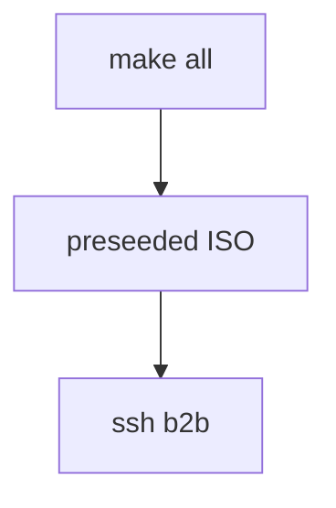

# Born2beRoot — Fully Automated VM Builder

> One command to build a complete Born2beRoot Debian VM with SSH, WordPress,
> Docker, and VS Code Remote SSH that actually works.

```text
make all
```

That's it. Go grab a coffee. Come back to a fully configured VM.

Plain `make` prints the help instead — building downloads an ISO, creates a VM
and runs a ~20-minute install, which is more than a bare `make` should start by
accident.

---

## Table of Contents

- [What Is This](#what-is-this)
- [Quick Start](#quick-start)
- [What `make all` Does (Step by Step)](#what-make-all-does-step-by-step)
- [Makefile Commands](#makefile-commands)
- [Connecting with VS Code Remote SSH](#connecting-with-vs-code-remote-ssh)
- [⚠️ Known Issue: VS Code SSH Drops After 15 Minutes](#️-known-issue-vs-code-ssh-connection-drops-after-15-minutes)
- [⚠️ Known Issue: Docker Permission Denied](#️-known-issue-docker-permission-denied-after-first-boot)
- [Credentials](#credentials)
- [What's Inside the VM](#whats-inside-the-vm)
- [The Neovim Setup](#the-neovim-setup)
- [Disk Layout & Growing a Partition](#disk-layout--growing-a-partition)
- [Herdr, opencode & Optional AI](#herdr-opencode--optional-ai)
- [Project Structure](#project-structure)
- [Troubleshooting](#troubleshooting)

---

## What Is This

I built this because I was tired of manually installing Debian, configuring SSH,
setting up WordPress, and then having VS Code Remote SSH die on me every 15
minutes.

This project automates the **entire Born2beRoot setup** from zero to a working
VM:

- Downloads the latest Debian netinst ISO
- Injects a preseed file for fully unattended installation
- Creates a VirtualBox VM with the right specs
- Installs Debian with LUKS encryption + LVM partitions (bonus part)
- Configures SSH on port 4242, UFW, sudo, password policy, AppArmor
- Installs Docker, WordPress, lighttpd, MariaDB, PHP-FPM
- Sets up the monitoring script with cron
- Configures your host's `~/.ssh/config` so `ssh b2b` just works
- Injects your SSH public key so you never type a password
- Configures VS Code Remote SSH settings to fix the timeout bug

Everything is scripted. `make re` destroys everything and rebuilds from scratch.

---

> ![INFO] now to implement the

## Quick Start

### Prerequisites

- **VirtualBox** installed (or run `make deps` to install it)
- **xorriso** and **curl** (also installed by `make deps`)
- ~18 GB free disk space during a build; ~15 GB once installed
  (the VM disk is capped at 14 GB, plus ~1.7 GB of ISOs that
  `make slim` removes afterwards — see **Disk Layout** below)

### Build the VM

```bash
git clone https://github.com/LESdylan/setup_arch_linux.git
cd setup_arch_linux
make all
```

The orchestrator will:

1. Install dependencies if needed
2. Download the Debian ISO
3. Inject the preseed + setup scripts into the ISO
4. Create the VirtualBox VM (2GB RAM, 3 CPUs, 32GB disk)
5. Boot and install Debian automatically (~15-25 min depending on your machine)
6. Power off when done

### First Boot

`make all` already does this: it powers the VM back on off the disk, types the
LUKS passphrase into the virtual keyboard from the host, and waits for sshd. No
VirtualBox window is opened at any point in the pipeline.

To boot it yourself later:

1. Start the VM: `make start_vm` (headless, unlocks the disk for you)
2. Connect: `ssh b2b`

The disk passphrase is `tempencrypt123` (see `vm_pass.txt`, or set `VM_PASS` to
keep it out of the repo). You only type it by hand if you deliberately open the
console with `make gui_vm`.

### Watching a headless VM

Nothing renders the VM's screen, so its COM1 is wired to a file and both the
installer and the installed system boot with `console=ttyS0`. That file is the
VM's console as plain text:

```bash
make console      # follow it live — Ctrl+C stops watching, not the VM
make serial_log   # print it and exit
```

This is also what the `make all` dashboard reads: the `OS Install` row shows the
installer's own words ("Installing the base system 70%"), not a guess based on
elapsed time.

### "Encryption: disabled" — why that line is not about your disk

`VBoxManage showvminfo debian` reports:

```text
Encryption:                  disabled
```

That refers to **VirtualBox's own VDI encryption** (`VBoxManage encryptmedium`)
— a host-side layer that encrypts the `.vdi` container file. This project does
not use it, and does not need it.

The Born2beRoot requirement is **LUKS inside the guest**, which is very much on:

```text
$ lsblk
└─sda5                  part  crypto_LUKS   62G
  └─sda5_crypt          crypt LVM2_member   62G
    ├─LVMGroup-root     lvm   ext4         9.5G /
    ...

$ sudo cryptsetup luksDump /dev/sda5
Version:        2
  cipher: aes-xts-plain64
  PBKDF:  argon2id
```

The two are independent, and only the second one gates the boot. Boot the VM
without sending the passphrase and it stops dead at
`Please unlock disk sda5_crypt:` — sshd never comes up, no matter how long you
wait.

### The VirtualBox Extension Pack is optional

`make deps` reports it as absent and moves on:

```text
· VirtualBox Extension Pack not installed (optional — make extpack)
```

That is not a problem to fix. The pack adds USB 2.0/3.0 passthrough, VRDP, NVMe,
PXE boot and VDI-level disk encryption. This VM uses NAT networking, a SATA
disk, guest-side LUKS and a serial console — none of which touch it.

It is kept out of `make all` on purpose. Installing it writes to
`/usr/lib/virtualbox`, so it needs root, and a sudo prompt in the middle of the
build is a trap: sudo asks for `[sudo] password for dlesieur`, and `dlesieur` is
_also_ the VM's username, so the VM password gets typed in and the build looks
broken when nothing is wrong.

If you want the extras:

```bash
make extpack
```

It says plainly whose password it wants, asks exactly once, and prints the real
error if it fails instead of hiding it.

### Why the unlock uses `keyboardputstring`, not `addencpassword`

`VBoxManage controlvm <vm> addencpassword` is the VDI-encryption command: it
takes a _password file_ and feeds `encryptmedium`'s host-side layer. It cannot
reach the guest's LUKS prompt, because that prompt is drawn by the guest's own
initramfs — long before networking, guest additions, or any other host↔guest
channel exists.

The one channel that does exist at that moment is the **virtual keyboard**:

```bash
VBoxManage controlvm debian keyboardputstring "$passphrase"
VBoxManage controlvm debian keyboardputscancode 1c 9c   # Enter: make + break
```

That is what `unlock_vm.sh` sends, and it is what keeps the whole pipeline
headless. Two details it gets right and that are easy to get wrong:

- **The scancode is `1c 9c`, not `1c`.** `1c` alone is key-down; without the
  `9c` break code the Enter key stays held down.
- **Readiness is the SSH _banner_, not an open port.** VirtualBox's NAT
  forwarder accepts connections on the host port whether or not the guest is
  listening, so a bare "port is open" check reports success against a VM that is
  still sitting locked.

### Connect with VS Code

1. `Ctrl+Shift+P` → "Remote-SSH: Connect to Host..."
2. Select `b2b`
3. No password needed (SSH key was injected during install)

---

## What `make all` Does (Step by Step)

```text
make all
  │
  ├─ 1. Check/install dependencies (VirtualBox, xorriso, curl)
  │
  ├─ 2. Download latest Debian netinst ISO
  │     └─ Automatically detects the latest version from cdimage.debian.org
  │
  ├─ 3. Build custom ISO
  │     ├─ Inject preseed.cfg into initrd (fully automated install)
  │     ├─ Copy b2b-setup.sh (SSH, UFW, sudo, password policy, AppArmor, etc.)
  │     ├─ Copy monitoring.sh (Born2beRoot monitoring script)
  │     ├─ Copy first-boot-setup.sh (Docker + WordPress on first real boot)
  │     ├─ Copy host SSH public key (for passwordless auth)
  │     └─ Rebuild ISO with modified boot menu (auto-selects automated install)
  │
  ├─ 4. Create VirtualBox VM
  │     ├─ 2048 MB RAM, 3 CPUs, 64 GB dynamic disk
  │     ├─ VirtualBox NAT networking with port forwarding:
  │     │   SSH:4242  HTTP:80  HTTPS:443  Frontend:5173
  │     │   Backend:3000  Docker:5000  MariaDB:3306  Redis:6379
  │     │   Website:4322  osionos:3001-3003  Bridges:4000/4100/4200
  │     │   BaaS:8000-8001  Mailpit:8025  Auth:8787  Vault:18200
  │     └─ Attach the custom ISO
  │
  ├─ 5. Boot and install (unattended)
  │     ├─ Debian installer runs preseed.cfg
  │     ├─ LUKS + LVM partitions created automatically
  │     ├─ b2b-setup.sh runs in chroot (16 configuration sections)
  │     └─ VM powers off when done
  │
  └─ 6. Configure host
        ├─ Write ~/.ssh/config (b2b alias, keepalives)
        ├─ Configure VS Code settings.json (fix SSH timeout bug)
        └─ Display summary with credentials and URLs
```

---

## Makefile Commands

| Command                 | Description                                                                 |
| ----------------------- | --------------------------------------------------------------------------- |
| `make`                  | Print the help (the default goal)                                           |
| `make all`              | **Full pipeline** — build everything from zero                              |
| `make re`               | **Destroy and rebuild** — clean slate (see the note below)                  |
| `make status`           | Show environment status dashboard                                           |
| `make start_vm`         | Start headless + auto-unlock encryption                                     |
| `make bstart_vm`        | Alias for `make start_vm`                                                   |
| `make console`          | Follow the headless VM's serial console live                                |
| `make serial_log`       | Print the serial console log and exit                                       |
| `make gui_vm`           | Escape hatch: open the VirtualBox window                                    |
| `make poweroff`         | Shut down the VM                                                            |
| `make deps`             | Install VirtualBox + tools                                                  |
| `make extpack`          | Install the VirtualBox Extension Pack (optional)                            |
| `make fix_app_ports`    | Repair VirtualBox NAT forwarding for the osionos/ft_transcendence app ports |
| `make gen_iso`          | Download Debian ISO + inject preseed                                        |
| `make setup_vm`         | Create the VirtualBox VM                                                    |
| `make clean`            | Remove downloaded ISOs                                                      |
| `make fclean`           | Remove ISOs + disk images                                                   |
| `make rm_disk_image`    | Delete the VM completely                                                    |
| `make prune_vms`        | Delete ALL VirtualBox VMs                                                   |
| `make list_vms`         | List all VirtualBox VMs                                                     |
| `make provision`        | Re-run the Neovim + hellishrc install inside a built VM                     |
| `make nvim`             | Neovim + kickstart + extras + Excalidraw, every plugin installed & verified |
| `make hellish_plugins`  | The hellishrc plugin framework                                              |
| `make nvim_health`      | Print `:checkhealth` from inside the VM                                     |
| `make devtools`         | Herdr (persistent terminal panes) + opencode (AI coding agent)              |
| `make excalidraw`       | Rebuild just the Excalidraw editor (`:Excalidraw`)                          |
| `make ai AI_MODE=local` | Ollama + a model sized to the VM's RAM                                      |
| `make global_scope`     | Put npm globals and AI models on `/opt`                                     |
| `make help`             | Show this help in the terminal                                              |

> **`make all` does not reinstall the OS on an existing VM.**
> `setup/install/vms/install_vm_debian.sh` keeps the disk image if one is
> already there (_"Virtual disk already exists - Keeping existing disk"_), so on
> a machine that has been built before, `make all` re-creates the VM around the
> **old** disk and boots the system that was already on it. That is deliberate —
> it is what makes a re-run after a failed step cheap — but it means that to
> actually reinstall Debian you need **`make re`** (or `make rm_disk_image`
> first), which deletes the disk. Watch the VDI size to tell them apart: a real
> reinstall starts from a ~2 MB empty disk.

---

## Connecting with VS Code Remote SSH

After `make all` completes, your host is already configured. Just:

```text
Ctrl+Shift+P → Remote-SSH: Connect to Host → b2b
```

The orchestrator automatically:

- Wrote `~/.ssh/config` with a `b2b` alias pointing to the VM's actual forwarded
  host port
- Injected your SSH public key into the VM (no password needed)
- Configured VS Code settings to prevent the SOCKS proxy timeout bug

### SSH Aliases

You can connect from the terminal with any of these:

```bash
ssh b2b            # shortest
ssh vm             # also works
ssh born2beroot    # full name
```

---

## ⚠️ Known Issue: VS Code SSH Connection Drops After ~15 Minutes

### The Problem

If you use VS Code Remote SSH with the **default settings** to connect to a
VirtualBox VM with NAT networking, the connection will die after ~15 minutes of
idle time with:

```text
Connection timed out during banner exchange
```

The VS Code log shows:

```text
Running server is stale. Ignoring
```

SSH from the terminal works fine. Only VS Code breaks.

### Why This Happens

VS Code Remote SSH defaults to **"Local Server Mode"**
(`remote.SSH.useLocalServer: true`). In this mode, it runs:

```text
ssh -T -D 49963 -o ConnectTimeout=15 user@host
```

That `-D` flag creates a **SOCKS5 proxy**. All VS Code traffic goes through this
single shared tunnel. VirtualBox NAT has a connection tracking table with an
idle timeout (~5-15 min). When the SOCKS proxy data channels go idle, VirtualBox
NAT silently drops them. The SSH keepalives keep the TCP connection alive, but
the SOCKS data inside the tunnel is dead.

This is a **VS Code + VirtualBox NAT** issue, not an SSH issue. Documented in:

- [microsoft/vscode-remote-release#1721](https://github.com/microsoft/vscode-remote-release/issues/1721)
- [microsoft/vscode-remote-release#10580](https://github.com/microsoft/vscode-remote-release/issues/10580)

### The Fix

Add these to your VS Code `settings.json` (`Ctrl+Shift+P` → "Preferences: Open
User Settings (JSON)"):

```json
{
  "remote.SSH.useLocalServer": false,
  "remote.SSH.enableDynamicForwarding": false,
  "remote.SSH.useExecServer": false,
  "remote.SSH.connectTimeout": 60,
  "remote.SSH.showLoginTerminal": true
}
```

**What this does:**

- `useLocalServer: false` → **Terminal Mode**: each window gets its own direct
  SSH connection (no shared SOCKS proxy)
- `enableDynamicForwarding: false` → removes the `-D` flag entirely, uses direct
  TCP forwarding
- `useExecServer: false` → simpler connection, less cached state to go stale

Then clean stale server cache:

```bash
rm -rf ~/.config/Code/User/globalStorage/ms-vscode-remote.remote-ssh/vscode-ssh-host-*
```

Or run this one-liner to fix everything automatically:

```bash
python3 -c "
import json, os, glob

## Fix VS Code settings
p = os.path.expanduser('~/.config/Code/User/settings.json')
try:
    s = json.load(open(p))
except:
    s = {}
s['remote.SSH.useLocalServer'] = False
s['remote.SSH.enableDynamicForwarding'] = False
s['remote.SSH.useExecServer'] = False
s['remote.SSH.connectTimeout'] = 60
s['remote.SSH.showLoginTerminal'] = True
json.dump(s, open(p, 'w'), indent=4)

## Clean stale cache
for d in glob.glob(os.path.expanduser('~/.config/Code/User/globalStorage/ms-vscode-remote.remote-ssh/vscode-ssh-host-*')):
    import shutil; shutil.rmtree(d, ignore_errors=True)

print('Done! Reload VS Code (Ctrl+Shift+P → Developer: Reload Window)')
"
```

> **Note:** `make all` already does this automatically. This section is for
> people who configured their VS Code manually or are hitting this issue on an
> existing setup.

For the full deep dive (12 hours of debugging distilled into one doc), see
[`doc/SSH_VSCODE_FIX.md`](doc/SSH_VSCODE_FIX.md).

---

## ⚠️ Known Issue: Docker "Permission Denied" After First Boot

### The Problem

After `make re` and connecting to the VM, Docker commands fail:

```text
permission denied while trying to connect to the Docker daemon socket
at unix:///var/run/docker.sock
```

### Why This Happens

Docker is installed by `first-boot-setup.sh` during the **first real boot** (it
needs systemd + network, so it can't run during preseed). When Docker installs,
it adds `dlesieur` to the `docker` group. But if VS Code's Remote SSH server was
**already running** before Docker finished installing, the server process has a
stale group list — it doesn't know about the `docker` group.

Linux group changes only take effect on **new login sessions**. The VS Code
server is a persistent process (`--enable-remote-auto-shutdown`), so even
reconnecting from VS Code reuses the same stale server.

> **This is now auto-fixed:** `first-boot-setup.sh` kills any running VS Code
> server after adding the docker group, and `b2b-setup.sh` pre-creates the
> `docker` group during preseed so it's present from the very first login. If
> you still hit this on an older build, use the manual fix below.

### The Fix

**Kill the VS Code server on the VM and reconnect:**

```bash
## From the host — kill stale VS Code server
ssh b2b 'pkill -f vscode-server'

## Then reconnect from VS Code:
## Ctrl+Shift+P → Remote-SSH: Connect to Host → b2b
```

Or from VS Code:

```text
Ctrl+Shift+P → Remote-SSH: Kill VS Code Server on Host → select b2b
Then reconnect.
```

Or from a terminal inside the VM:

```bash
## Start a new shell with the docker group
newgrp docker

## Verify it works
docker ps
```

This is a one-time issue that only happens on the very first connection after
`make re`. Every subsequent connection will have the `docker` group loaded.

### Verify Docker is Working

```bash
## From the host
ssh b2b 'docker ps && echo "Docker OK"'

## From inside the VM
docker run --rm hello-world
```

---

## Credentials

| What                 | Value            |
| -------------------- | ---------------- |
| Root password        | `temproot123`    |
| User (dlesieur)      | `tempuser123`    |
| LUKS disk encryption | `tempencrypt123` |
| SSH port             | `4242`           |

> ⚠️ Change these passwords after setup if you're doing the real Born2beRoot
> evaluation.

---

## What's Inside the VM

### Born2beRoot Mandatory Part

- ✅ Debian Trixie (latest stable)
- ✅ LUKS encrypted disk + LVM partitions (root, swap, home, var, srv, tmp,
  var-log)
- ✅ SSH on port 4242 (no root login)
- ✅ UFW firewall (only 4242, 80, 443 open)
- ✅ sudo with strict rules (3 tries, TTY required, full logging)
- ✅ Password policy (min 10 chars, uppercase, lowercase, digit, max 3 repeats)
- ✅ AppArmor enabled at boot
- ✅ Monitoring script via cron (every 10 minutes, wall broadcast)
- ✅ Hostname: `dlesieur42`

### Born2beRoot Bonus Part

- ✅ WordPress with lighttpd + MariaDB + PHP-FPM
- ✅ Docker + Docker Compose
- ✅ Custom LVM partition layout per subject requirements

### Extra (Quality of Life)

- ✅ **Neovim (latest upstream) + kickstart.nvim + a full IDE plugin layer** —
  see [The Neovim Setup](#the-neovim-setup)
- ✅ **hellishrc plugin framework** (`~/.hellish/` — `conf list`, `hxp list`,
  `help_conf`)
- ✅ tmux with auto-attach (SSH sessions survive disconnects)
- ✅ Git configured for NAT (large clone fix)
- ✅ Developer tools (build-essential, python3, curl, vim, htop, etc.)
- ✅ SSH key auth (no passwords for VS Code)
- ✅ NAT keepalive service (prevents VirtualBox NAT timeout)
- ✅ SSHD watchdog service (auto-restarts if sshd dies)
- ✅ Aggressive keepalives (both client and server side)

### Partition Layout

```text
sda
├── sda1          500 MB   /boot        (ext2, unencrypted)
└── sda5          ~31 GB   LUKS encrypted
    └── LVM
        ├── root      5.0 GB   /
        ├── swap      1.0 GB   [SWAP]
        ├── home      5.0 GB   /home
        ├── var      12.0 GB   /var
        ├── srv       1.0 GB   /srv
        ├── tmp       1.5 GB   /tmp
        └── var-log   ~5 GB    /var/log   (fills remaining space)
```

### Port Forwarding (NAT)

| Service            | Host Port                | VM Port |
| ------------------ | ------------------------ | ------- |
| SSH                | auto-selected from 4242  | 4242    |
| HTTP               | auto-selected from 8082  | 80      |
| HTTPS              | auto-selected from 8443  | 443     |
| Vite Frontend      | auto-selected from 5173  | 5173    |
| Backend API        | auto-selected from 3000  | 3000    |
| Website            | auto-selected from 4322  | 4322    |
| osionos app        | auto-selected from 3001  | 3001    |
| osionos Mail       | auto-selected from 3002  | 3002    |
| osionos Calendar   | auto-selected from 3003  | 3003    |
| osionos bridge API | auto-selected from 4000  | 4000    |
| Mail bridge        | auto-selected from 4100  | 4100    |
| Calendar bridge    | auto-selected from 4200  | 4200    |
| BaaS gateway       | auto-selected from 8000  | 8000    |
| BaaS admin         | auto-selected from 8001  | 8001    |
| Local mail inbox   | auto-selected from 8025  | 8025    |
| Auth gateway       | auto-selected from 8787  | 8787    |
| Vault              | auto-selected from 18200 | 18200   |
| Docker Registry    | auto-selected from 5000  | 5000    |
| MariaDB            | auto-selected from 3306  | 3306    |
| Redis              | auto-selected from 6379  | 6379    |

For the full host/VM diagnosis and manual repair commands, see
[doc/VM_APP_PORT_FORWARDING.md](doc/VM_APP_PORT_FORWARDING.md).

---

## The Neovim Setup

The VM ships a complete Neovim environment, installed automatically on first
boot. Nothing to run by hand — `ssh b2b`, type `nvim`, and it is there.

### Why not `apt install neovim`

Debian 13 ships **Neovim 0.10.4**. The `kickstart.nvim` config this is built on
uses **`vim.pack`**, Neovim's built-in plugin manager, which did not exist
before **0.12** — on 0.10 the config errors out on its first plugin line. There
is no backport and no official Debian package for 0.12, so the build installs
the upstream release tarball under `/opt/nvim-<version>`, symlinks it to
`/usr/local/bin/nvim`, and registers it as the system `editor`/`vi`/`vim`
alternative. dpkg's world is left completely untouched.

```text
nvim --version          # NVIM v0.12.5
apt-cache policy neovim # Candidate: 0.10.4-8   ← what Debian would have given you
```

### Layout

The kickstart checkout is kept **pristine**, so `git -C ~/.config/nvim pull`
keeps working forever. Everything added on top lives in files kickstart does not
own — Neovim sources `plugin/*.lua` from the config directory automatically,
after `init.lua`:

```text
~/.config/nvim/
├── init.lua                      unmodified kickstart.nvim
└── plugin/
    ├── 00-b2b-local.lua          providers, clipboard, machine-local settings
    ├── 05-b2b-pack.lua           the shared install helper + :B2BExtras
    ├── 10-b2b-plugins.lua        the editing/navigation plugin layer
    ├── 20-b2b-keymaps.lua        the VS Code bindings
    ├── 30-b2b-sessions.lua       sessions / "workspaces"
    ├── 40-b2b-startup.lua        the file tree + start page
    ├── 50-b2b-markdown.lua       markdown rendering + browser preview
    └── 60-b2b-ide.lua            lint, debug, test, terminal, outline, SQL, AI
```

Files in `plugin/` are sourced in name order, which is why `05-` comes first:
it publishes the `_G.B2B` helper that `10-`, `50-` and `60-` all install
through, so there is one copy of the install-and-report logic rather than
three. All of them are listed in `.git/info/exclude`, so `git status` in the
kickstart checkout stays clean.

### What you see when you open it

`nvim` opens with the **file tree on the left** and a start page listing the
keybindings — so the editor looks configured, and the bindings are discoverable
without going back to this README.

Every plugin in the table below loads on startup; most of them are _passive_
(indent guides, rainbow parentheses, git signs in the gutter, the tab bar) and
simply appear once there is a file on screen. That is worth saying explicitly,
because before `40-b2b-startup.lua` existed a bare `nvim` showed the **stock
Neovim splash screen** and looked completely unconfigured — everything was
loaded, nothing was visible.

**The tree deliberately does not open** for `nvim -d` (diffs), for more than one
file argument, for man pages, or — most importantly — when git invokes Neovim as
its editor. `nvim` is this VM's `$EDITOR`, so `git commit` runs it; a sidebar
over a commit message leaves an extra window git then waits on. That case is
detected from `GIT_EXEC_PATH`/`GIT_INDEX_FILE` rather than by matching
filenames, with the usual `COMMIT_EDITMSG`/`MERGE_MSG`/`git-rebase-todo` names
as a backstop. During a commit you get committia.vim's split diff instead.

`:B2BStart` reopens the start page at any time.

### What is installed on top of kickstart

Following [itsjfx's "5 weeks of Neovim" write-up](https://itsjfx.com/), which is
what this setup is modelled on:

| Need                                 | Plugin                                                                                                                                                                                                                                                                                                                                                                                                                                           |
| ------------------------------------ | ------------------------------------------------------------------------------------------------------------------------------------------------------------------------------------------------------------------------------------------------------------------------------------------------------------------------------------------------------------------------------------------------------------------------------------------------ |
| Buffer manager (the VS Code tab bar) | [barbar.nvim](https://github.com/romgrk/barbar.nvim)                                                                                                                                                                                                                                                                                                                                                                                             |
| Directory manager                    | [oil.nvim](https://github.com/stevearc/oil.nvim) (edit a directory as a buffer)                                                                                                                                                                                                                                                                                                                                                                  |
| Sidebar                              | [neo-tree.nvim](https://github.com/nvim-neo-tree/neo-tree.nvim)                                                                                                                                                                                                                                                                                                                                                                                  |
| Colorizer                            | [nvim-colorizer.lua](https://github.com/catgoose/nvim-colorizer.lua)                                                                                                                                                                                                                                                                                                                                                                             |
| Session manager                      | [vim-obsession](https://github.com/tpope/vim-obsession) + the `vw` command                                                                                                                                                                                                                                                                                                                                                                       |
| Rainbow parentheses                  | [rainbow-delimiters.nvim](https://github.com/HiPhish/rainbow-delimiters.nvim)                                                                                                                                                                                                                                                                                                                                                                    |
| Indentation guides                   | [indent-blankline.nvim](https://github.com/lukas-reineke/indent-blankline.nvim)                                                                                                                                                                                                                                                                                                                                                                  |
| Movement                             | [leap.nvim](https://github.com/ggandor/leap.nvim), [quick-scope](https://github.com/unblevable/quick-scope), [mini.move](https://github.com/nvim-mini/mini.nvim)                                                                                                                                                                                                                                                                                 |
| Git                                  | [vim-fugitive](https://github.com/tpope/vim-fugitive), [vim-flog](https://github.com/rbong/vim-flog), [vim-gh-line](https://github.com/ruanyl/vim-gh-line) (+ kickstart's gitsigns)                                                                                                                                                                                                                                                              |
| Fuzzy finding                        | [fzf](https://github.com/junegunn/fzf) + [fzf.vim](https://github.com/junegunn/fzf.vim), beside kickstart's telescope                                                                                                                                                                                                                                                                                                                            |
| Quality of life                      | [bullets.vim](https://github.com/bullets-vim/bullets.vim), [mini.cursorword](https://github.com/nvim-mini/mini.nvim), [committia.vim](https://github.com/rhysd/committia.vim), [vim-easy-align](https://github.com/junegunn/vim-easy-align), [nvim-treesitter-context](https://github.com/nvim-treesitter/nvim-treesitter-context), [rainbow_csv](https://github.com/mechatroner/rainbow_csv), [vim-repeat](https://github.com/tpope/vim-repeat) |

**Two deliberate substitutions**, both because the post's choice is now dead:

- **Rainbow parentheses** — the post uses lincheney's fork of `nvim-ts-rainbow`.
  That fork _and_ its upstream were **archived in 2023** and target the old
  nvim-treesitter API; kickstart tracks nvim-treesitter's `main` branch, where
  neither loads at all. `rainbow-delimiters.nvim` is the maintained successor.
- **bullets.vim** — `dkarter/bullets.vim` now redirects to
  `bullets-vim/bullets.vim`.

### Markdown, and the rest of the VS Code feature list

`50-b2b-markdown.lua` and `60-b2b-ide.lua` cover what is left:

| VS Code feature | Here | Where |
| --------------- | ---- | ----- |
| Markdown preview, in the buffer | [render-markdown.nvim](https://github.com/MeanderingProgrammer/render-markdown.nvim) | `<leader>mr` |
| Markdown preview, in a browser | [markdown-preview.nvim](https://github.com/iamcco/markdown-preview.nvim) — mermaid + KaTeX | `<leader>mp` |
| Autocomplete | blink.cmp | _kickstart_ |
| Go to definition / references / rename | `vim.lsp` | _kickstart_ |
| Inline errors | LSP diagnostics | _kickstart_ |
| Auto formatting | conform.nvim | _kickstart_, `<leader>f` |
| Linting | [nvim-lint](https://github.com/mfussenegger/nvim-lint) + shellcheck / markdownlint-cli2 | on write |
| File explorer | oil.nvim / neo-tree | `-` / `Ctrl+B` |
| Fuzzy search | telescope / fzf | `Ctrl+P` |
| Git gutter | gitsigns | _kickstart_, `<leader>h…` |
| Git UI | **lazygit** (Debian package) in a floating terminal | `<leader>gg` |
| Debugger | [nvim-dap](https://github.com/mfussenegger/nvim-dap) + dap-ui | `F5` / `F9`, `<leader>d…` |
| Test runner | [neotest](https://github.com/nvim-neotest/neotest) (+ the python adapter) | `<leader>r…` |
| Terminal | [toggleterm.nvim](https://github.com/akinsho/toggleterm.nvim) | `Ctrl+\` |
| Symbol outline | [aerial.nvim](https://github.com/stevearc/aerial.nvim) | `<leader>o` |
| Tabs / buffers | barbar (above) | `Alt+1`…`Alt+9` |
| Breadcrumbs | [nvim-navic](https://github.com/SmiteshP/nvim-navic), in the winbar | automatic |
| Project management | `vim.fs.root()` + the session manager | automatic, `:B2BRoot` |
| AI assistant | [codecompanion.nvim](https://github.com/olimorris/codecompanion.nvim) | `<leader>a…` |
| REST client | [kulala.nvim](https://github.com/mistweaverco/kulala.nvim) | `<leader>k…` |
| SQL client | [vim-dadbod](https://github.com/tpope/vim-dadbod) + dadbod-ui | `<leader>D` |

**Three more things deliberately not installed:**

- **bufferline.nvim** — barbar is the same feature, and two tab bars fight over
  the tabline.
- **project.nvim** — last commit April 2023. What it is wanted for here is "cd
  to the project root", and **`vim.fs.root()` has been in Neovim's standard
  library since 0.10**, so that is fifteen lines instead of a dead dependency.
  Its other half, "reopen the project I was on", is already the session manager.
- **a Mason package for the debugger** — gdb has spoken DAP natively since
  gdb 14 (`gdb -i dap`) and trixie ships 16.3, so C/C++ debugging uses the gdb
  that is already installed. No codelldb download, no Rust toolchain.

### Everything is installed at build time, and checked

`nvim` in this VM opens **finished**: every plugin cloned, every tree-sitter
parser compiled, the language servers in place, and the three prebuilt binaries
that are not part of any git checkout already fetched — blink.cmp's fuzzy
library, the markdown-preview server, and kulala's `kulala-core` + http grammar.

That is not just an intention, it is checked. After the install the build runs
`nvim-verify.lua` inside Neovim with your real config loaded and fails when
anything the config declares is not actually on disk:

| Checked | How |
| --- | --- |
| every plugin `vim.pack` knows about | the directory exists **and holds code** — a repo whose branch was emptied upstream clones perfectly and installs nothing |
| every tree-sitter parser | kickstart's list plus `B2B.parsers` (C, C++, PHP, JS/TS, SQL, Dockerfile, …) |
| language servers and formatters | `lua-language-server` and `stylua` are executable |
| the prebuilt binaries | blink.cmp's `.so`, markdown-preview's server |

A failure prints one `PROBLEM` line per finding, records `nvim-extras` as
failed in `/etc/b2b/features.status`, and **stops `make all`**. The plugin
download is retried up to three times before that verdict, ten seconds apart,
because on a NAT'd VM in its first minute of network a failed clone is ordinary
— and `vim.pack` reports one as a notification, not an error.

> The 2026-09-12 build is why this exists: first boot ran the bootstrap with
> `NVIM_BOOTSTRAP=0`, sent its output to `/dev/null`, and produced a VM whose
> `nvim` was missing all 38 extra plugins — reported as `nvim ok`.

Run **`:B2BExtras`** inside Neovim to see what loaded, and
`~/.local/state/nvim/bootstrap.log` for what the build's Neovim runs printed.

#### Mermaid, Excalidraw, and how the browser part reaches your host

Two of the VS Code features people miss most are graphical, and the VM has no
display. Both run as a **web server inside the VM, rendered by the browser on
your host** — no X server in the VM, which the subject would score 0 for.

| | Where | Port in the VM |
| --- | --- | --- |
| Markdown preview, with **mermaid** diagrams and KaTeX | `<leader>mp` | 8420 |
| **Excalidraw** drawings | `:Excalidraw` / `<leader>me` | 8421 |

Both bind **`127.0.0.1` only**, and the build writes the two forwards into the
`Host b2b` block of your host's `~/.ssh/config`:

```sshconfig
LocalForward 8420 127.0.0.1:8420
LocalForward 8421 127.0.0.1:8421
```

So while you are connected with **`ssh b2b`**, the URL Neovim prints is a URL
your host browser opens as it is. Nothing to tunnel by hand. (A second
concurrent `ssh b2b` cannot bind the same two host ports and says so on stderr;
the session itself is unaffected. From an ssh session that did not come from
this config, tunnel it yourself: `ssh -p 4242 -L 8420:127.0.0.1:8420
dlesieur@127.0.0.1`.)

**Mermaid** needs nothing extra — a ```` ```mermaid ```` fenced block is a
diagram in the preview:

````markdown

````

**Excalidraw** is the real editor — the official `@excalidraw/excalidraw`
React component, bundled at build time into `/opt/excalidraw` (22 MB, fonts
included, no CDN at runtime) and served by a ~140-line Node server with no
dependencies. `:Excalidraw` on any buffer starts it, creates the `.excalidraw`
file if it is new, and prints the URL:

```text
:Excalidraw                  draw for the current file (notes.md → notes.excalidraw)
:Excalidraw diagram          create/open diagram.excalidraw
<leader>me                   the same, for the current buffer
excalidraw diagram           the same from any shell in the VM
```

Every change is saved back to the `.excalidraw` **and** exported beside it as
`<name>.excalidraw.svg`, with the scene embedded — so the drawing renders in
the markdown preview, on GitHub, and re-opens in excalidraw.com:

```markdown

```

The Neovim side is one more drop-in (`55-b2b-excalidraw.lua`), the server stops
with the Neovim that started it, and the file API only accepts absolute
`*.excalidraw` paths.

Port 8420/8421 and not 8080/8090 on purpose: this VM already serves lighttpd on
80/443 and the Inception stack on 8080/8081/8082 with its static site on 8090.
Override with `NVIM_MKDP_PORT` / `EXCALIDRAW_PORT`. Binding to loopback rather
than `0.0.0.0` also means UFW's allow-list needs no hole punched in it — and
the Excalidraw file API is never exposed beyond your own ssh session.

### Keybindings

The VS Code muscle memory, kept for the transition. Each has a native equivalent
— delete the line from `20-b2b-keymaps.lua` when it starts feeling redundant.

| Key                         | Does                            | Native equivalent           |
| --------------------------- | ------------------------------- | --------------------------- |
| `Ctrl+P`                    | Quick open file                 | `<leader>sf`                |
| `Ctrl+Shift+F`              | Search across files             | `<leader>sg`                |
| `Ctrl+/`                    | Toggle comment                  | `gcc` / `gc`                |
| `Ctrl+B`                    | Toggle the sidebar              | `:Neotree toggle`           |
| `Ctrl+S`                    | Save                            | `:w`                        |
| `Alt+,` / `Alt+.`           | Previous / next buffer          | `:bprev` / `:bnext`         |
| `Alt+<` / `Alt+>`           | Move the buffer left / right    | —                           |
| `Alt+1`…`Alt+9`             | Jump to buffer N                | —                           |
| `Alt+c`                     | Close buffer                    | `:bd`                       |
| `-`                         | Open the parent directory (oil) | —                           |
| `ga`                        | Align a selection               | —                           |
| `<leader>gs` / `<leader>gl` | Fugitive status / Flog graph    | —                           |
| `<leader>zf` / `<leader>zg` | fzf files / ripgrep             | `<leader>sf` / `<leader>sg` |

Three of these are famous for "not working", and all three are handled:

- **`Ctrl+/`** — terminals traditionally transmit it as `Ctrl+_`. Both are
  mapped.
- **`Ctrl+S`** — the tty eats it as XOFF (flow control) before Neovim sees it.
  `/etc/profile.d/nvim-extras.sh` runs `stty -ixon` for interactive shells.
- **`Ctrl+Shift+F`** — most terminals genuinely cannot send it. It is mapped for
  the ones that can; `<leader>sg` always works.

### Sessions — the VS Code "workspace" equivalent

`:mksession` writes a one-shot snapshot. `vim-obsession` turns it into a _live_
session file that keeps rewriting itself as you open buffers and change
directory, which is what people actually mean by a workspace.

|                      |                                                                         |
| -------------------- | ----------------------------------------------------------------------- |
| `<leader>sS`         | Start (or rename) a session for this project                            |
| `<leader>sX`         | Stop recording — the file stays, it just stops updating                 |
| `<leader>sF`         | Pick a saved session and load it                                        |
| `:B2BSession <name>` | Same, with the name on the command line                                 |
| `vw`                 | From the shell: list every session and the directory it was recorded in |
| `vw <name>`          | Open that session                                                       |

Sessions live in `~/.nvim-sessions/`.

`vw` is after
[itsjfx's original](https://github.com/itsjfx/dotfiles/blob/master/bin/vw), with
one change: the original ships a **zsh** completion, and this VM's login shell
is **hellish**, which has no programmable completion at all (`complete` and
`compgen` are not implemented — see its own `rc.d/70-completion.hsh`). So `vw`
with no arguments _lists_ the sessions instead, which is the same information
the zsh completion showed in its descriptions. A bash completion is installed at
`/etc/bash_completion.d/vw` for anyone using bash.

### Working remotely — the part that makes this worth it

Everything runs inside **tmux on the VM**, so a session survives the SSH
connection dropping _and_ survives closing the laptop:

```bash
ssh b2b                 # tmux auto-attaches
vw myproject            # or just: nvim
## ... close the laptop, go home, open it again ...
ssh b2b                 # exactly where you left off
```

The installer appends a Neovim block to `~/.tmux.conf`: true colour
(`tmux-256color` + `Tc` overrides, without which every colourscheme renders in
16 colours), `escape-time 10` (the default 500 ms is what makes leaving insert
mode feel laggy, and `:checkhealth` flags it), focus events, and a 50k
scrollback.

### Health

```bash
make nvim_health        # from the host
:checkhealth            # from inside nvim
```

The full report is written to `~/.local/state/nvim/checkhealth.log` at install
time. A healthy VM reports **0 errors**. The node and python3 providers are
installed (the latter in its own venv, because Debian marks the system python3
as PEP 668 externally-managed); the perl and ruby providers are switched **off**
on purpose, since nothing here uses them and leaving them unset makes
`:checkhealth` warn forever.

The warnings that remain are all expected on a headless server:

| Warning                                            | Why it is fine                                                                                                                                                                                          |
| -------------------------------------------------- | ------------------------------------------------------------------------------------------------------------------------------------------------------------------------------------------------------- |
| `No clipboard tool found`                          | There is no X display on a headless VM. xclip _is_ installed; with no `$DISPLAY` Neovim cannot use it, so `00-b2b-local.lua` turns `clipboard` off rather than let every yank stall on a failing xclip. |
| `Go/cargo/luarocks/Ruby/java/julia: not available` | Mason listing optional language runtimes. They only matter if you install a language server that needs one.                                                                                             |
| `gio not found`                                    | An optional glib2 helper. Nothing here uses it.                                                                                                                                                         |

> **If you run `:checkhealth` over a non-interactive SSH command you will see
> errors that are not real.** `TERM=dumb` (what a non-interactive SSH session
> gets) makes Neovim's terminal check fail with
> `command failed: { "infocmp", "-L" }` and makes a couple of plugin checks come
> back empty. The same report with `TERM=xterm-256color` has zero errors. The
> installer sets a sane `TERM` for exactly this reason — but if you are checking
> by hand, do it from a real terminal, or set `TERM` yourself.

---

## Disk Layout & Growing a Partition

One number sizes the whole VM: **`SIZE_B2B`, in GB, default 15** (the school
quota). The disk, the partition layout, what gets installed and the cap
`make space` enforces are all derived from it. Preview any size without
building:

```bash
make partitions SIZE_B2B=50     # the layout
make features   SIZE_B2B=50     # what gets installed, and whether it fits
```

The layout is not scaled proportionally — that gives a 100 GB `/tmp` on a
500 GB disk and floors that don't fit on 10 GB. Every volume has a **floor**
(a working Debian fits on 8 GB), a **weighted share** of what is left, and a
**cap** (nothing is gained past 30 GB of `/`); `/var` takes the remainder,
because Docker is the thing that actually grows. Below 8 GB the build is
refused with the size that would work. The default, 15 GB:

| Mount      | Size    | Holds                                                    |
| ---------- | ------- | -------------------------------------------------------- |
| `/boot`    | 500 MB  | kernel, unencrypted (required)                           |
| `/`        | 4.3 GB  | Debian (~1.1 GB), apt packages, Docker + node binaries   |
| swap       | 2 GB    | follows RAM (1–4 GB), mounted with `discard`             |
| `/home`    | 1.1 GB  | nvim plugins/parsers, hellish (sources stay on the host) |
| `/opt`     | 570 MB  | **machine-wide scope** — see below                       |
| `/srv`     | 380 MB  | service data (lighttpd)                                  |
| `/tmp`     | 440 MB  | build artefacts                                          |
| `/var/log` | 570 MB  | system + Docker logs                                     |
| `/var`     | ~5.2 GB | Docker images, containers, build cache, WordPress        |

These were **calibrated on a real build**: the first cut gave `/` 3.3 GB and
left no room for nvim, because the Debian base system (~1.1 GB) was not in
the cost table at all. `/etc/b2b/features.status` on a built guest records
what each feature actually took; that is where the next correction comes
from.

`generate/partition_recipe.sh` computes it; the copy in `preseeds/preseed.cfg`
is its output for the default and `tests/test_partition_recipe.sh` fails if the
two drift.

### Why it is this small, and why that took a fix

This used to be a 120 GB disk, on the reasoning that a thin-provisioned image is
a ceiling rather than an allocation — it costs nothing until it is used. That
reasoning was wrong here, and the cost was measured: the qcow2 reached **42.7 GB
on the host** for a guest holding a small fraction of it.

A thin disk is only thin while something tells it which blocks are free, and
nothing did. The guest is LUKS-encrypted, and dm-crypt drops discard requests
unless the mapping is opened with `allow-discards`. With no `discard` in
`/etc/crypttab`, no `issue_discards` in `lvm.conf` and no `fstrim.timer`, no
TRIM ever reached the image — so it only ever grew. And because a freed block
under LUKS is ciphertext rather than zeroes, `qemu-img convert` could not
reclaim it either.

`preseeds/b2b-setup.sh` now wires that chain end to end, so the host file tracks
real usage instead of high-water mark. Check it inside the guest with:

```bash
sudo dmsetup table sda5_crypt | grep -o allow_discards   # must print
lsblk -D                                                 # DISC-MAX non-zero
```

### `/var` absorbs the remainder, on purpose

partman insists on putting all the leftover space somewhere: with every volume
pinned and none using `-1`, it still inflates the **last** volume in the recipe
(`/var/log` once asked for 3072 MB and got 20.34 GB). The old recipe absorbed
that with a decoy volume, `spare`, which was formatted and mounted and then
`lvremove`d — and every cluster `mkfs` touched stayed allocated in the image
forever.

So `spare` is gone. `/var` is declared last with an explicit `-1`, which turns
that behaviour into the mechanism: the remainder lands where Docker needs it.

The group is fully allocated by design, so growing one volume means shrinking
another (or enlarging the disk). `-r` resizes the filesystem in the same step:

```bash
sudo lvreduce -r -L -1G /dev/LVMGroup/home
sudo lvextend -r -L +1G /dev/LVMGroup/var
df -h /var
```

Tunable at build time (a new VM only — an existing disk is kept):

```bash
make re DISK_SIZE_MB=20480      # bigger disk; `make space` must still pass
make re VM_RAM_MB=6144          # more RAM than the 25%-of-host default
make re LUKS=OFF                # unencrypted — FAILS the evaluation, dev only
```

### Reclaiming space

```bash
make space              # what the project costs, against the SIZE_B2B+1 GB budget
make slim               # drop used ISOs, apt-clean + fstrim inside the guest
make slim COMPACT=1     # also rewrite the qcow2 without unreferenced clusters
```

### Installation profiles

What the provisioners install is decided **on the host, from `SIZE_B2B`**, and
checked against the layout above before the ISO is built. It used to be
decided at runtime, inside the guest, by free-space guards that printed
`[SKIP]` and carried on — so a small disk produced no error, just a VM quietly
missing things, and Docker could run before nvim and starve it.

| Profile      | `SIZE_B2B` | Installs                                                                                                                                          |
|--------------|------------|---------------------------------------------------------------------------------------------------------------------------------------------------|
| **minimal**  | 8–14       | everything Born2beRoot mandates, dev tools (gcc, python3, …), **nvim + kickstart**, **hellish**                                                   |
| **standard** | 15–29      | + the bonus web stack (lighttpd/MariaDB/PHP/WordPress), Docker, Node + npm globals, pipx tools, the nvim IDE layer + Excalidraw, Herdr + opencode |
| **full**     | 30+        | every non-explicit feature (today the same set as standard; the name is stable so it can grow)                                                    |

AI (`AI_MODE=client|local`) is never chosen automatically. Base features cannot
be turned off. Everything else can be, per feature:

```bash
make all SIZE_B2B=10                        # minimal
make all SIZE_B2B=10 FEATURES=+docker       # minimal plus Docker — fits, so it builds
make all SIZE_B2B=13 PROFILE=standard       # refused: "fits from SIZE_B2B=14"
make all FEATURES="-pytools -devtools-extra"
```

A set that does not fit **fails the ISO build** naming the mount and the
smallest `SIZE_B2B` that works. Docker's `/var` figure (3.3 GB) is measured:
Inception with bonus — nine alpine images plus a Rust build stage — left
2.35 GB of build cache alone on the host that built it. `make inception`
checks `/var` has that much free before building and prunes the build cache
after a successful build, so the steady state stays inside the estimate.
The resolved set ships in the ISO as
`/etc/b2b/features.conf`; the guest scripts install exactly that, required
features first. First boot records what each feature _actually_ cost to
`/etc/b2b/features.status` — the estimates in `generate/feature_profile.sh`
are meant to be corrected from it. A required feature that fails to install
prints `B2B-FEATURE-FAILED` on the serial console and **fails `make all`**;
inside the guest, `/etc/b2b/PROVISION_FAILED` says why and the MOTD flags it.

### Machine-wide scope: `/opt`, not `/` or `/home`

Three kinds of data usually get conflated. `/home` is user data, `/` is what
dpkg manages — and the third kind, machine-wide extras that dpkg does _not_
manage, has no natural home and defaults into `/`:

- npm globals → `/usr/lib/node_modules`
- Ollama models → `/usr/share/ollama/.ollama/models`

Both are on a root filesystem sized for apt. One 5 GB model fills it, and a full
`/` breaks dpkg and GRUB — the exact cascading failure this project's preseed
comments already warn about.

`setup/install/tools/install_global_scope.sh` gives `/opt` its own volume and
points those paths at it: `/opt/npm-global`, `/opt/ai/models`, plus
`/opt/nvim-*` which already lived there. Per-user Neovim state
(`~/.local/share/nvim`) stays per-user — it is small, nvim needs write access,
and sharing it only creates permission problems.

---

## Herdr, opencode & Optional AI

### Herdr — persistent terminal panes

[Herdr](https://herdr.dev) is a single ~10 MB Rust binary that splits into a
persistent background server and a TUI client: panes, splits and workspaces that
keep running when the client detaches.

```bash
herdr                  # attach (or start)
## ctrl+b q             detach — panes keep running
ssh b2b && herdr       # reattach later, from anywhere
```

**This is also the answer to window tiling here.** A tiling window manager
(Krohnkite and friends) is a KWin script, so it needs X.org or Wayland — and the
subject is explicit that installing a graphics server scores **0**. Herdr gives
the tiled-pane workflow entirely inside the terminal, with nothing installed
that could put the grade at risk.

### opencode

[opencode](https://opencode.ai) is the AI coding agent in this VM: one static
binary in `/usr/local/bin`, fetched from its GitHub release like Herdr, that
works with **any** provider — Anthropic, OpenAI, GitHub Copilot, or the local
Ollama below.

```bash
opencode                 # the TUI, in the project you are standing in
opencode auth login      # store a provider key (skip this with AI_MODE=local)
```

It replaced Claude Code on 2026-09-12, for two measured reasons: that one was
tied to a single vendor, and its npm tree was **414 MB on `/`** — the npm
prefix that was supposed to move it to `/opt` never applied to it. opencode is
176 MB, and `AI_MODE=local` wires it to a model running on the box, so the VM
has a coding agent that needs no account and no network.

Upstream's `curl https://opencode.ai/install | bash` is deliberately **not**
used: it installs per user into `~/.opencode/bin`, on the `/home` volume this
layout sizes for Neovim's plugins, and piping a remote script into a shell
during an unattended first boot is unreviewable.

### Optional AI — `AI_MODE`

Off by default: a stock build installs and downloads **nothing**, so evaluation
is unaffected.

| `AI_MODE`         | What it does                                                                                                              |
| ----------------- | ------------------------------------------------------------------------------------------------------------------------- |
| `off` _(default)_ | Nothing installed, no space used                                                                                          |
| `client`          | Ollama CLI pointed at an endpoint elsewhere — `10.0.2.2:11434` is the **host** under VirtualBox NAT. No models in the VM. |
| `local`           | Ollama server + a model stored on `/opt/ai/models`                                                                        |

```bash
make ai AI_MODE=local                 # on a built VM
make re VM_RAM_MB=6144 AI_MODE=local  # from scratch, with enough RAM
```

**The model is computed from measured RAM, never guessed:**

| Usable RAM | Model                          |
| ---------- | ------------------------------ |
| < 3 GB     | _none — refuses, and says why_ |
| 3–5 GB     | `qwen3:1.7b`                   |
| 5–8 GB     | `qwen3:4b`                     |
| 8–12 GB    | `qwen3:8b`                     |
| ≥ 20 GB    | `qwen3:14b`                    |

> **A 27B model cannot run here, at any quantization.** Qwen 3.8 27B needs ~17
> GB at Q4; this host has 7.8 GB _in total_. That is arithmetic, not tuning. A
> model that does not fit does not run slowly — it thrashes: the kernel evicts
> weight pages as fast as it faults them in, and a VM also running Docker and
> MariaDB becomes unusable. So `AI_MODE=local` **refuses** rather than pulling
> something that cannot work, and tells you what to raise.

With the default 2 GB VM, `AI_MODE=local` installs Ollama and pulls no model.
Raise `VM_RAM_MB` first.

---

## Project Structure

```text
.
├── Makefile                    # Entry point — all commands start here
├── README.md                   # This file
│
├── preseeds/
│   ├── preseed.cfg             # Debian preseed — fully automated install
│   ├── b2b-setup.sh            # Main post-install script (SSH, UFW, sudo, etc.)
│   ├── first-boot-setup.sh     # Docker + WordPress install (runs on first boot)
│   └── monitoring.sh           # Born2beRoot monitoring script
│
├── generate/
│   ├── orchestrate.sh          # TUI dashboard — orchestrates `make all`
│   ├── create_custom_iso.sh    # Downloads Debian ISO + injects preseed
│   ├── status.sh               # Environment status dashboard
│   └── help.sh                 # Makefile help display
│
├── setup/
│   └── install/vms/
│       └── install_vm_debian.sh # VirtualBox VM creation script
│
├── monitore/
│   ├── monitoring.sh           # Main monitoring script
│   └── classes/                # Modular monitoring components
│       ├── cpu-load-module.sh
│       ├── memory-module.sh
│       ├── disk-module.sh
│       └── ...
│
├── diagnostic/                 # Diagnostic scripts (run inside VM)
│   ├── b2b_verifier.sh
│   ├── check_internet.sh
│   ├── disk_details.sh
│   ├── LVM_CHECK.sh
│   └── ...
│
├── fixes/                      # Fix scripts for common issues
│   ├── fix_ssh_stability.sh
│   ├── fix_lighttpd_php_mysql.sh
│   └── ...
│
├── doc/
│   ├── SSH_VSCODE_FIX.md       # Deep dive: VS Code SSH timeout fix
│   └── en.subject.pdf          # Born2beRoot subject PDF
│
├── wordpress/                  # WordPress themes + plugins
├── management_tools/           # sudo/user management scripts
├── utils/                      # Color schemes, welcome screen
└── tests/                      # Security tests (AppArmor, WordPress)
```

---

## Troubleshooting

### "Connection refused" when trying `ssh b2b`

The VM isn't running or SSH isn't ready yet.

```bash
## Check VM status
make status

## Start the VM (headless, unlocks the disk itself)
make start_vm

## See what the VM is actually doing
make console

## Wait for SSH (check every 2 seconds)
while ! ssh -o ConnectTimeout=2 -o BatchMode=yes b2b exit 2>/dev/null; do
    echo "Waiting..."; sleep 2
done && echo "Ready!"
```

### "Connection timed out during banner exchange"

This is the VS Code SOCKS proxy bug. Run the fix:

```bash
python3 -c "
import json, os, glob, shutil
p = os.path.expanduser('~/.config/Code/User/settings.json')
try: s = json.load(open(p))
except: s = {}
s.update({'remote.SSH.useLocalServer':False,'remote.SSH.enableDynamicForwarding':False,'remote.SSH.useExecServer':False,'remote.SSH.connectTimeout':60,'remote.SSH.showLoginTerminal':True})
json.dump(s, open(p,'w'), indent=4)
[shutil.rmtree(d, True) for d in glob.glob(os.path.expanduser('~/.config/Code/User/globalStorage/ms-vscode-remote.remote-ssh/vscode-ssh-host-*'))]
print('Fixed! Reload VS Code.')
"
```

See [`doc/SSH_VSCODE_FIX.md`](doc/SSH_VSCODE_FIX.md) for the full explanation.

### Docker "permission denied"

Close and reopen your VS Code window. The `docker` group wasn't loaded in your
current session. See
[Known Issue: Docker Permission Denied](#️-known-issue-docker-permission-denied-after-first-boot).

### VM asks for password despite SSH key setup

Your SSH key wasn't injected during install (ISO build issue). Fix it manually:

```bash
## Copy your key to the VM (will ask for password ONE time)
SSH_PORT=$(ssh -G b2b 2>/dev/null | awk '$1 == "port" { print $2; exit }')
ssh-copy-id -p "$SSH_PORT" dlesieur@127.0.0.1
## Password: tempuser123

## Verify — should NOT ask for password
ssh b2b echo "Key auth works"
```

### VM hangs at "System halted" and doesn't power off

```bash
## Force power off from host
VBoxManage controlvm debian poweroff
```

### "Host key verification failed" after `make re`

Normal — the VM was rebuilt with a new host key. The `~/.ssh/config` already has
`StrictHostKeyChecking no` and `UserKnownHostsFile /dev/null` for the `b2b`
host, so this shouldn't happen. If it does:

```bash
SSH_PORT=$(ssh -G b2b 2>/dev/null | awk '$1 == "port" { print $2; exit }')
ssh-keygen -R "[127.0.0.1]:${SSH_PORT}"
```

### Full diagnostic dump (run from host)

```bash
ssh -o BatchMode=yes b2b '
echo "=== UPTIME ===" && uptime
echo "=== MEMORY ===" && free -m
echo "=== SSH ===" && systemctl is-active ssh && ss -tlnp | grep 4242
echo "=== DOCKER ===" && docker ps 2>&1 | head -3
echo "=== SERVICES ===" && systemctl is-active nat-keepalive sshd-watchdog docker
echo "=== GROUPS ===" && groups
echo "=== AUTH KEYS ===" && wc -l ~/.ssh/authorized_keys
'
```

---

## License

This is a 42 school project. Use it, learn from it, make it your own. Don't copy
it blindly for your evaluation — understand what each script does.

---

_Built with frustration, caffeine, and 12 hours of debugging VS Code SSH
timeouts._ 🫠
